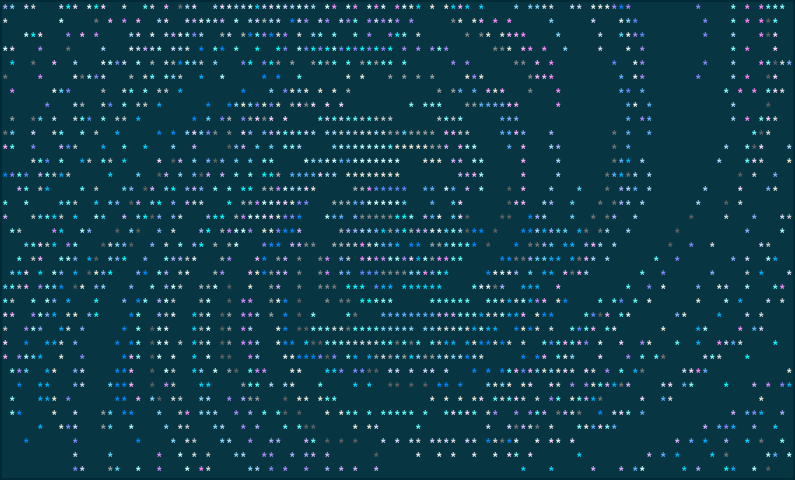

===========
startrail.c
===========

*Star trail in terminal.*

  Using::
  
    -x='(1+0.05*i)*(x*cos(i*pi/100)-y*sin(i*pi/100))'
    -y='(1+0.01*i)*(x*sin(i*pi/100)+y*cos(i*pi/100))'
    -l 0 -n 500

Basically, you stand on a north pole of a planet with no axial tilt and
counter-clockwise rotation like Earth, and no movements in this universe but
only the planetary rotation. You look up straight at night sky with a camera,
long-exposing for :math:`\pi/2`.

This is a simple simulation and it's not meant to be accurate. You can read
this blog post_ which is about the back story and thoughts or watch this video_
to see how it's animated.

.. _post: http://blog.yjl.im/2015/10/startrailc.html
.. _video: https://youtu.be/f4t0_H7Lkyw

.. contents:: **Contents**
   :local:

Installation
============

Requirments
-----------

* C99 and POSIX.1-2008 supported compiler
* POSIX-compliant system
* ncurses
* (optional) GNU libmatheval_ for evaluators

.. _libmatheval: https://www.gnu.org/software/libmatheval/

Steps
-----

Simply do the following to install under ``/usr/local``,

.. code:: bash

  make install

Or you can use ``PREFIX`` to choose the installation location, for example

.. code:: bash

  make PREFIX=$HOME/.local 

To uninstall, use ``uninstall`` target.

Options
-------

============  =====
name          value
============  =====
``matheval``  for evaluators_, 1 (default) to enable
============  =====

Technical notes
===============

Simple universe
---------------

This program simulates a very simple universe, stars and a planet which
observer can stand on. Nothing moves but the planet's rotation, which is
counter-clockwise like Earth in the perspective. There is no axial tilt unlike
Earth or any actual planets, this is to simplify when you stand at north pole,
every star will be long-exposed as a perfect circle.

stars generation
----------------

`new_star`` function generates ``-n #`` stars, each star has

* *angle* in :math:`[0, 2\pi)`

  The *angle* and *distance* are observed on the viewport.

* *distance* in :math:`[0, 1]`

  If *distance* is :math:`1`, it will be converted into |r|_.
  
  .. |r| replace:: :math:`r`

* *color* is randomly chosen from the available colors.

``expose`` function
-------------------

``expose`` is the heart of this program, it has four processes:

1. calculating the `new coordinate`_
2. applying evaluators_
3. applying `zooming factors`_
4. converting coordinate into terminal position

.. _variables:

With variables:

:math:`x`, :math:`y`
  The coordinate

:math:`a`, :math:`d`
  The star's initial angle and distance

:math:`i`
  The ordinal number of current iteration

:math:`s`
  The stepping value for rotating angle,

  .. math::

    \tan(\frac{SCALE_X}{CENTER_X})

.. _r:

:math:`r`
  The longest straight line can be drawn from the center of terminal window, in
  other words, from center to any corner. It's chosen this way for a
  possibility to fill up window with rings of trails.

  .. math::

    \sqrt{\left(\frac{SCREEN_H}{2}\right)^2 + \left(\frac{SCREEN_W \cdot SCALE_X}{2}\right)^2}

.. _new coordinate:

The rotation
''''''''''''

The first process calculates the new coordinate on the viewport after one
iteration of rotation.

.. math::

  x = d \cdot \cos(a + i \cdot s)

  y = d \cdot \sin(a + i \cdot s)

If ``-R`` is used, they will always be the initial coordinate.

.. math::

  x = d \cdot \cos(a)

  y = d \cdot \sin(a)

.. _evaluators:

``-x`` and ``-y`` evaluators
''''''''''''''''''''''''''''

These options enable you mathematical functions to manipulate star's
coordinate. Both are functions of seven variables_ and many functions and
constants are supported__.

__ https://www.gnu.org/software/libmatheval/manual/libmatheval.html#evaluator_005fcreate

.. math::

  x = f(x, y, a, d, i, s, r)

  y = f(x, y, a, d, i, s, r)

Basically, the first and third processes can be completely replaced by the
evaluators with ``-R`` and ``-Z`` to disable the two processes.

.. _zooming factors:

``-X`` and ``-Y`` zooming factor
''''''''''''''''''''''''''''''''

After the evaluators, the coordinate is manipulated as if viewport is zoomed,

.. math::

  x = x (1 + i \cdot factor_x)

  y = y (1 + i \cdot factor_y)

This process can be turned off by ``-Z`` option.

Terminal position conversion
----------------------------

The coordinate is converted into terminal position using

.. math::

  x & = & CENTER_X & + & r & \cdot & x & \cdot & SCALE_X \\
  y & = & CENTER_Y & - & r & \cdot & y

Controls
========

=========  ========
key        action
=========  ========
``space``  resume from pause (interval<0) / skip (large interval)
``c``      clear screen before next iteration
``q``      quit
=========  ========

Copyright
=========

The contents in this repository have been place into public domain via
Unlicense_.

.. _Unlicense: UNLICENSE
